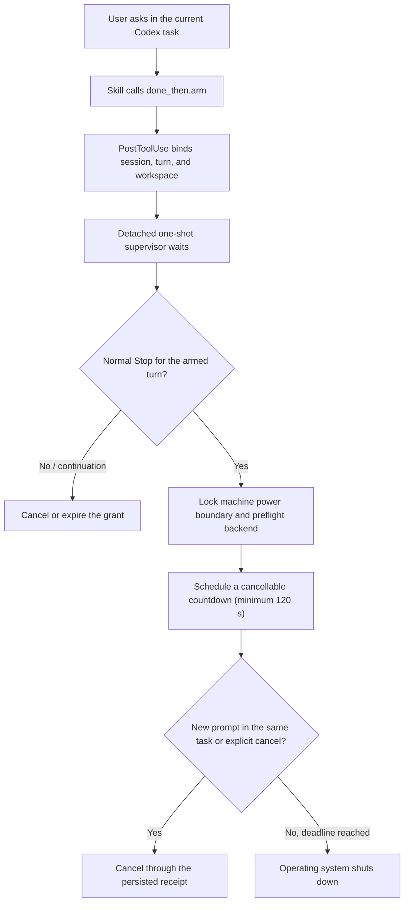

# DoneThen

**Shut down your computer when Codex stops — with a cancellable safety window.**

[](https://github.com/andyandymike/done-then/actions/workflows/ci.yml)
[](LICENSE)

DoneThen is an open-source Codex plugin for the moment when you want to leave a
long task running and have the computer shut down after Codex returns control.
You ask inside the original Codex task; Codex arms DoneThen, and the plugin
observes that same task's lifecycle. You do not open a second watcher window or
start another Codex run.

> [!IMPORTANT]
> A Codex `Stop` means the current turn stopped. It does **not** mean the work
> succeeded. A partial result, failed check, blocked task, or question can also
> end in `Stop`. Real `after_stop` mode therefore requires explicit acceptance
> of that behavior and always uses a cancellable countdown of at least two
> minutes.

DoneThen is pre-alpha. The Windows and Linux action paths are present, but real
cancel and power-off release acceptance is still pending. macOS power actions
remain unsupported. Build and review the source before using execute mode.

## How it works

Once the plugin and `donethen` runtime are installed, say this in the Codex task
you want to leave running:

```text
Use $done-then to shut down this computer two minutes after this Codex turn
stops. I understand that Stop does not prove the task succeeded and that a
partial, blocked, failed, or question-ending response can also start the
countdown.
```

Codex handles the transport commands itself. The user does **not** run
`donethen run`, `donethen mcp`, or a separate executable window for this flow.



The bundled Hooks are observers. They emit no model-facing output, return no
`decision: block`, and do not edit or replace user, project, managed, or other
plugin Hooks. Matching Hooks from all sources continue to run under Codex's
normal Hook rules.

## Two trigger policies

### `after_stop` — default

This is the practical workflow. It deliberately answers only one question:
“did the armed Codex turn stop?” It does not inspect task semantics and does not
call `finish` or a verifier.

- The grant is one-shot, time-limited, and bound by the arm Hook to the current
  Codex session, turn, and workspace.
- Execute mode requires `acknowledge_stop_without_success=true`.
- The execute delay must be between 120 and 3600 seconds.
- A later user prompt in the same Codex task, a Stop-Hook continuation, expiry,
  platform failure, or explicit cancellation prevents or cancels the action.
- Closing Codex after an accepted Stop does not silently revoke a shutdown the
  user explicitly requested.
- Dry-run records the matching Stop without calling the power backend.

### `verified_success` — experimental

The older strict workflow remains available in code for development. It uses a
structured completion envelope, an optional fixed verifier profile, App Server
host evidence, and H1/H2/H3 Hook-policy snapshots. Public plugin execute for
this policy remains disabled because DoneThen cannot yet prove that its App
Server connection owns the currently active Codex host.

This mode is separate from `after_stop`: a `Stop` is never promoted into a
semantic success claim.

## Safety and recovery

DoneThen keeps the action boundary narrow:

- Only the fixed `shutdown` action is accepted; model-generated command strings
  are never executed.
- The platform backend is preflighted before an execute job is armed and again
  before scheduling.
- Real power jobs are serialized with a machine-level lock. An unresolved
  action intent or receipt blocks later jobs.
- The supervisor persists intent before calling the operating system and keeps
  a receipt for cancellation and post-boot reconciliation.
- If scheduling returns an unknown outcome, DoneThen does not retry the power
  action automatically.
- The countdown is monitored. Same-task continuation, interruption,
  cancellation, or an excessively late wake attempts a receipt-bound
  cancellation.
- Prompts, transcripts, model responses, environment dumps, and raw session or
  turn identifiers are not stored.

The acknowledgement field is a workflow assertion supplied in the typed MCP
call and governed by the Skill and the user's MCP approval settings; DoneThen
does not read or persist the conversation to independently prove consent. Do
not auto-approve destructive MCP tools if that is outside your threat model.

Manual recovery remains available even if the plugin is disabled:

```powershell
donethen status [job-id]
donethen cancel [job-id]
donethen reconcile <job-id>
donethen doctor [--json]
```

On Windows, `shutdown.exe /a` is system-global, so aborting a DoneThen
countdown can also abort another concurrently scheduled Windows shutdown.

## Current capabilities

Capability levels describe evidence, not just code. C1 means portable
build/unit-test coverage; C2 adds dry-run and fake-backend coverage. No row
below claims completed real power-off acceptance.

| Platform | Level | Published statement |
| --- | --- | --- |
| `windows-amd64` | C2 | preview; after-stop plugin path and real backend code are present, but real cancel and poweroff acceptance are pending |
| `windows-arm64` | C1 | portable build only; native acceptance is pending |
| `linux-amd64` | C1 | systemd helper code is present; installation and real-host acceptance are pending |
| `linux-arm64` | C1 | systemd helper code is present; installation and real-host acceptance are pending |
| `darwin-amd64` | C1 | portable build only; signed and notarized helper is not delivered |
| `darwin-arm64` | C1 | portable build only; signed and notarized helper is not delivered |

The machine-readable source is
[`internal/capability/manifest.json`](internal/capability/manifest.json):
`after_stop` execute is enabled by default on supported platform families;
`verified_success` execute is disabled by default.

Platform backends:

- Windows uses the absolute system `shutdown.exe` for scheduling and `/a` for
  cancellation, with receipt and boot reconciliation.
- Linux uses a root-owned, fixed-operation Unix-socket helper and job-specific
  systemd transient units. Installing that helper is a separate reviewed step.
- macOS returns an explicit unsupported result until a signed and notarized
  privileged helper with authenticated IPC is delivered.

## Install for local development

There is no supported binary download or public marketplace release yet. The
repository includes a reversible Windows development installer that stages an
ignored local marketplace and never rewrites personal or project Hook files
directly.

Requirements:

- Go 1.26 or newer to build the current source.
- A Codex build with plugin, MCP, and lifecycle Hook support.
- Windows PowerShell or PowerShell 7 for the development installer.
- Linux additionally needs the reviewed systemd helper installation before
  execute preflight can pass.

Build from a checkout you have reviewed:

```powershell
git clone https://github.com/andyandymike/done-then.git
Set-Location done-then
go test -count=1 ./...
go vet ./...
New-Item -ItemType Directory -Force bin | Out-Null
go build -trimpath -o bin\donethen.exe ./cmd/donethen
go version -m bin\donethen.exe
.\bin\donethen.exe --version
```

Review the local plugin plan before applying it:

```powershell
pwsh -NoProfile -File .\scripts\dev-plugin.ps1 -Action Plan
pwsh -NoProfile -File .\scripts\dev-plugin.ps1 `
  -Action Install `
  -DoneThenPath .\bin\donethen.exe `
  -Apply
```

Start a new Codex task, inspect the DoneThen definitions with `/hooks`, and
trust only the exact definitions you reviewed. Use `-Action Reinstall` after
changing the plugin package and review its new Hook definition again.

See [Local plugin development](docs/plugin-development.md) for the full
install, smoke, status, and uninstall procedure.

## Try dry-run first

In a newly started Codex task:

```text
Use $done-then in after_stop dry-run mode for this turn. Do not invoke a power
action. When the turn stops, show me the DoneThen job_id so I can inspect it.
```

The expected terminal state is `DRY_RUN_COMPLETE` with reason
`after_stop_observed_no_action`. Dry-run does not require the semantic
completion envelope, `finish`, a verifier, App Server authority, or a power
policy.

For real execute mode, `arm` uses this contract:

```json
{
  "action": "shutdown",
  "trigger_policy": "after_stop",
  "acknowledge_stop_without_success": true,
  "delay_seconds": 120,
  "expires_in_seconds": 3600,
  "mode": "execute",
  "verifier_profile": "none",
  "allow_agent_only_success": false
}
```

The Skill supplies these typed fields. This JSON is documentation, not a
command the user normally enters.

## Legacy `codex exec` wrapper

`donethen run` is the earlier standalone path. It starts a new non-interactive
`codex exec` process and combines its schema-constrained response with an
optional external verifier. It remains useful for development, but it is not
the intended plugin UX.

```powershell
donethen run `
  --action shutdown `
  --dry-run `
  --delay 120s `
  --verify-program go `
  --verify-arg test `
  --verify-arg ./... `
  -- codex exec -C C:\path\to\project "Implement and verify the requested change"
```

## Antivirus and unsigned binaries

Pre-alpha Windows binaries are unsigned. New local Go executables, including
temporary Go test binaries, can receive heuristic or cloud antivirus
detections even when built from reviewed source.

Do not disable antivirus or add a broad exclusion. If a file is detected, keep
it quarantined and record the commit, exact SHA-256, antivirus product/database
version, and detection name. Reproduce only from a clean checkout and report
the evidence through the issue tracker, or use [SECURITY.md](SECURITY.md) when
the behavior differs from the reviewed source or the report is sensitive.

Release builds avoid packers, obfuscation, and stripped Go symbols and publish
checksums, provenance attestations, and SPDX SBOMs. Those controls improve
inspectability; they are not code signing and cannot prevent every heuristic
false positive.

## Repository layout

```text
cmd/donethen/             CLI, MCP, Hook, and supervisor entry point
cmd/donethen-powerd/      Linux fixed-operation system power helper
.codex-plugin/            Codex plugin manifest
.mcp.json                 bundled stdio MCP server declaration
skills/done-then/         user-facing workflow
hooks/hooks.json          non-interfering lifecycle observers
internal/pluginapi/       typed MCP operations
internal/pluginstate/     atomic jobs, indexes, migration, and redacted events
internal/hookobserver/    session, turn, workspace, Stop, and cancel binding
internal/pluginpower/     detached supervisor and action gate
internal/actions/         fake, Windows, Linux, and unsupported macOS backends
internal/hostauthority/   experimental verified-success host evidence
scripts/                  reversible development and smoke tooling
tests/                    contract tests and fixtures
docs/                     GitHub Pages source and operational guidance
```

Maintainer notes under `spec/` and `specs/` are intentionally ignored and are
not part of the public repository contract. Stable contributor-facing behavior
belongs in tracked documentation and tests.

## Project status and roadmap

- [x] Bundle a Skill, typed MCP server, and lifecycle Hooks without replacing
  existing Hook sources.
- [x] Add the default session-bound `after_stop` trigger.
- [x] Launch a detached supervisor and schedule only after the matching Stop.
- [x] Keep a minimum two-minute cancellation window and cancel on continuation.
- [x] Persist recovery intent and receipts around the platform action boundary.
- [x] Retain the experimental `verified_success` state machine separately.
- [x] Add Windows and Linux platform implementations and safe macOS rejection.
- [ ] Complete real Windows countdown/cancel and power-off acceptance.
- [ ] Complete Linux helper installation and real-host acceptance per target.
- [ ] Deliver a signed/notarized macOS helper, if the project chooses to support
  macOS power actions.
- [ ] Publish reviewed release artifacts and a public plugin installation path.

## Contributing

DoneThen is an ordinary open-source project; paid code signing or notarization
is not required to contribute. Read [CONTRIBUTING.md](CONTRIBUTING.md), report
vulnerabilities through [SECURITY.md](SECURITY.md), and use the public
[issue tracker](https://github.com/andyandymike/done-then/issues) for ordinary
bugs and feature requests that contain no sensitive data.

Relevant Codex documentation:

- [Lifecycle Hooks](https://learn.chatgpt.com/docs/hooks)
- [Codex plugin packaging](https://developers.openai.com/plugins/build/plugins)
- [Codex App Server](https://learn.chatgpt.com/docs/app-server)

## License

DoneThen is licensed under the [Apache License 2.0](LICENSE).
